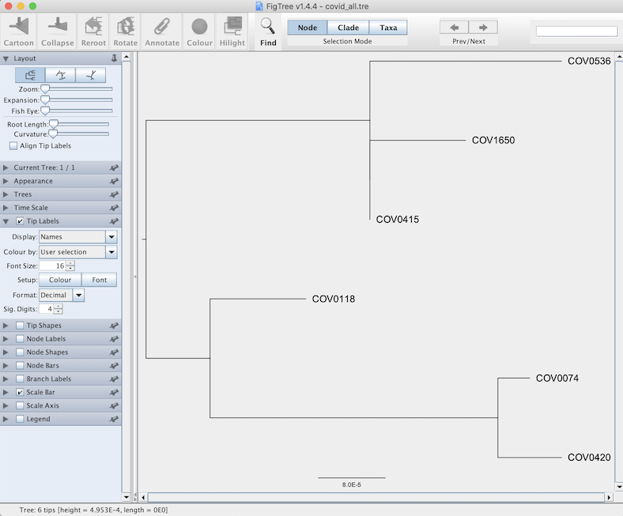

# Microbial Genomics In-Class Activity

### DGP-485 Data Science for Biomedical Researchers
**April 10, 2024**

*Egon A. Ozer, MD PhD (<e-ozer@northwestern.edu>)*  
 
---

### 1. Set up environment on Quest  
This command will load the Mamba package manager and create a Conda environment named `dsbr_covid` that will contain all the software needed for this exercise. By setting up Conda environments you can have multiple versions of software on the same computer and (mostly) avoid conflicts between software packages. For a nice introduction to Conda, see [this tutorial](https://towardsdatascience.com/a-guide-to-conda-environments-bc6180fc533) or [here](https://docs.conda.io/projects/conda/en/latest/index.html) for more detail. 

**a.** Load the Mamba module on Quest. 
  
```
module load mamba
```  
  *  You can also install Mamba or Conda on your personal computer (all of the analyses in this exercise can easily be done on a laptop). I recommend Mamba or Micromamba as the installation of software packages into environments with Mamba tends to be much faster and smoother than with Conda or Anaconda. See [here](https://mamba.readthedocs.io/en/latest/) for more information on installing Mamba or Micromamba. If you install Conda and/or Mamba on you computer you do not need to load it as a module.  

**b.** Create the environment and load the required software packages from the `bioconda` channel. This may take several minutes

```
module load gcc/9.2.0

mamba create -c bioconda -n dsbr_covid \
bwa=0.7.17 \
samtools=1.9 \
ivar mafft=7.471 \
fasttree=2.1.10 \
treetime
```
  *  If you are installing on Quest, the default gcc version is insufficient for building ivar so you need to load the gcc version 9.2.0 module. If you are installing on your own computer odds are that your gcc version will work just fine. 


**c.** Activate the environment to use the software

```
conda activate dsbr_covid
```

**d.** Create a working folder for results

```
mkdir dsbr_covid

cd dsbr_covid
```

**e.** Copy the reference and example sequences to the working directory

```
cp -r /projects/e30682/COVID_sequencing/* .
```

#### OTHER REQUIRED SOFTWARE

Download **FigTree** to your personal computer be able to view phylogenetic trees:
[https://github.com/rambaut/figtree/releases](https://github.com/rambaut/figtree/releases)

<a rel="license" href="https://github.com/rambaut/figtree/releases](https://github.com/rambaut/figtree/releases"></a> 

---

### 2. Generate consensus sequence of COV1650  

**a.** Align Illumina sequence reads to the reference genome sequence [MN908947.3](https://www.ncbi.nlm.nih.gov/nuccore/MN908947.3/). 

  * BWA is used to align the reads to the reference and samtools is used to generate a sorted alignment file in the bam binary format. To save time and space the output of the bwa alignment can be piped (using the `|` character) directly to the bam conversion, which can then piped again to the sorting step. The `-F 4` option in the samtools view command excludes any reads that do align to the reference. Finally, the sorted bam file is indexed. 

```
bwa mem ref/nCoV-2019.reference.fasta reads/COV1650_1.fastq.gz reads/COV1650_2.fastq.gz > COV1650.sam 

samtools view -bS -F 4 COV1650.sam > COV1650.bam

samtools sort -o COV1650_sorted.bam COV1650.bam

samtools index COV1650_sorted.bam
```

**b.** Trim amplification primers from the alignment using ivar. The ivar manual is  [here](https://andersen-lab.github.io/ivar/html/manualpage.html) if you're curious.

  * This removes the portions of each read sequence corresponding to the sequencing primers used in the multiplex amplification of the genome sequences from the patient specimens. Since the primer sequences were based on the reference genome, they may mask variants in the sequenced genome that fall within the primer binding sites. The `-q` option sets the minimum base quality threshold.

```
ivar trim -q 20 -i COV1650_sorted.bam -b ref/nCoV-2019.ivar.bed -p COV1650.trimmed

samtools sort -o COV1650.trimmed_sorted.bam COV1650.trimmed.bam

samtools index COV1650.trimmed_sorted.bam
```

**c.** Identify variants relative to the refrence sequence and generate a consensus seqeunce using ivar.

  * Each step first generates a pileup from the alignment. The ivar variants command uses a minimum frequency threshold of 0.03 (3%) to output variant positions. The ivar consensus command produces a consensus sequence from the reference sequence based on the variants observed in the pileup file. 

```
samtools mpileup -aa -A -d 0 -Q 0 --reference ref/nCoV-2019.reference.fasta COV1650.trimmed_sorted.bam  > COV1650.pileup.txt

ivar variants -p COV1650.variants -t 0.03 < COV1650.pileup.txt

ivar consensus -m 10 -q 20 -t 0 -p COV1650.consensus < COV1650.pileup.txt
```

**Outputs**:

Type | File Name
--- | ---
Consensus sequence | `COV1650.consensus.fa`
Variant file | `COV1650.variants.tsv`


---


### 3. Perform a phylogenetic analysis of the SAR-CoV-2 genomes

**a.** First we'll simplify the header of the COV1650 consensus file using a simple perl one-liner.

```
perl -pe "s/>.*/>COV1650/" COV1650.consensus.fa > COV1650.consensus_renamed.fa
``` 

**b.** Combine the renamed consensus sequence with the other example sequences.

```
cat COV1650.consensus_renamed.fa seqs/covid.fasta > covid_all.fasta
```

**c.** Align the sequences to each other using MAFFT.

```
mafft --auto covid_all.fasta > covid_all.mafft.fasta
```

**d.** Generate a maximum likelihood phylogenetic tree using FastTree.

  * We'll use the Generalized Time Reversible model (`-gtr`) with a gamma model of evolutionary rate between sites (`-gamma`).  

```
fasttree -nt -gtr -gamma covid_all.mafft.fasta > covid_all.tre
```

**e.** You can either download the tree file to your computer or, as a shortcut, just print the file to the screen then copy and paste it to a new text file on your computer.

```
cat covid_all.tre
```
  * Now you can view the tree file using FigTree. Some useful manipulations you can do is increase the font size using in the "Tip Labels" side bar. You may also want to view this as an unrooted tree by midpoint rooting the tree using the "Tree" menu (command-m on a Mac)



**f.** 


**When you are all done...**
Deactivate the conda environment. 

```
conda deactivate
```

---

<a rel="license" href="http://creativecommons.org/licenses/by-sa/4.0/"></a><br />This work is licensed under a <a rel="license" href="http://creativecommons.org/licenses/by-sa/4.0/">Creative Commons Attribution-ShareAlike 4.0 International License</a>.
